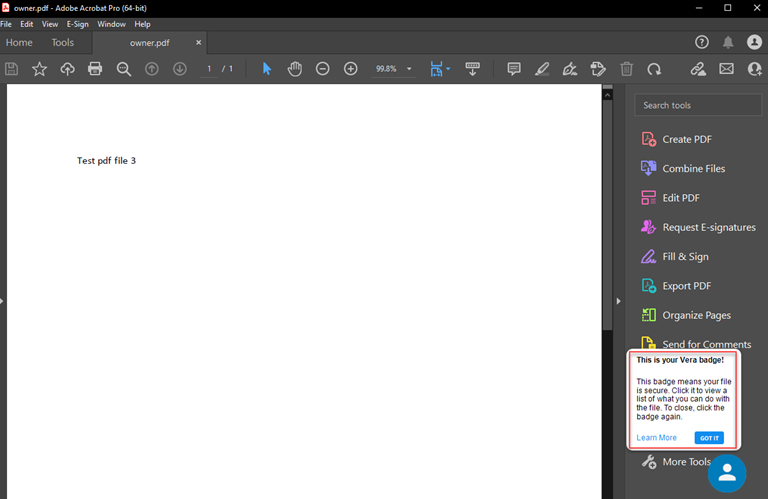
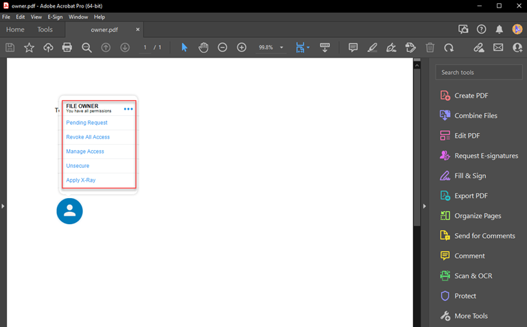
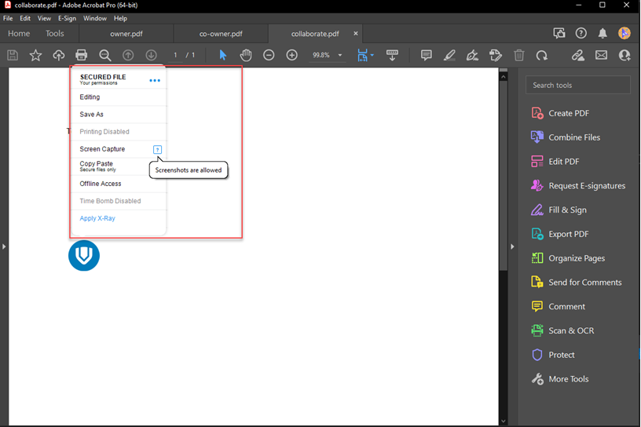
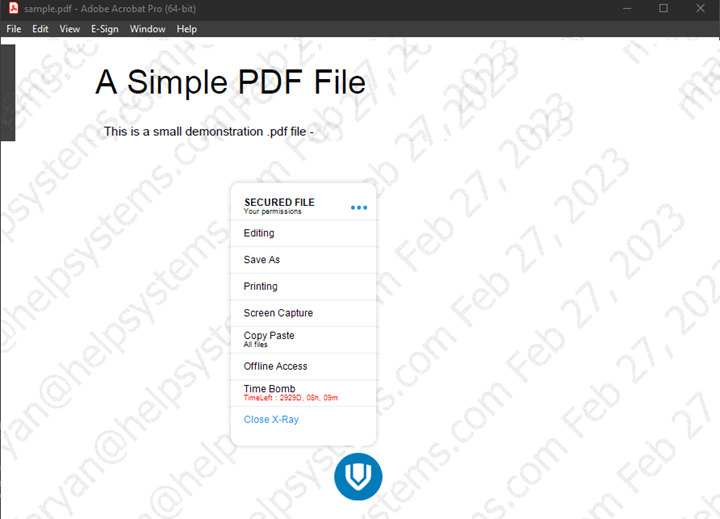
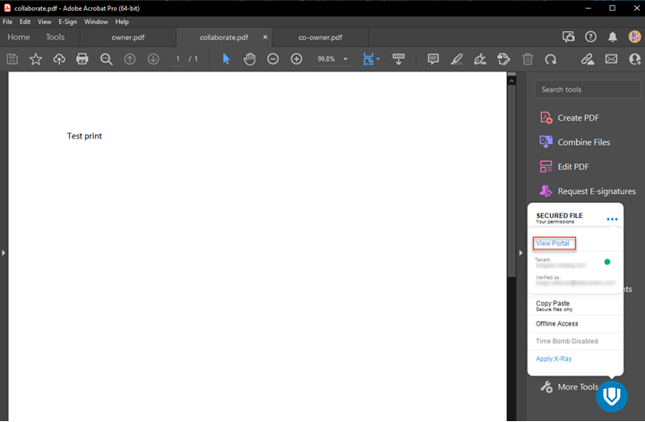
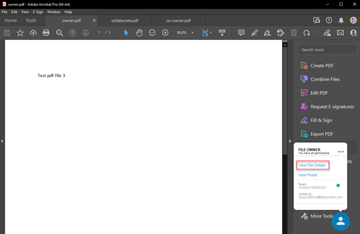

# Vera Policy Badge

## Introduction

The **Vera Policy Bar** has been replaced by the **Vera Policy Badge** in the Vera client. The Policy Badge gives file owners an improved view of permissions, actionable items, and classification options.

The Policy Bar is replaced by the Policy Badge for all shimmed applications except CAD applications and Microsoft Visio.

!!! note
    For Adobe Acrobat, the Policy Bar is replaced by the Policy Badge only in shim mode. In pivot mode, the Policy Bar is still retained.

When users open a secure file for the first time in a supported application, they will see the Policy Badge and a welcome message.

The Policy Badge experience depends on the user's role. There are three user types:

- [Policy Badge Flow - File Owner](#policy-badge-flow-file-owner)
- [Policy Badge Flow - Regular User](#policy-badge-flow-regular-user)
- [Policy Badge Flow - Co-Owner](#policy-badge-flow-co-owner)

Click the Policy Badge icon to open the menu. Click the ellipsis (`...`) to open the sub-menu.

## Policy Badge Flow - File Owner

File owners can manage access and policies with owner-level permissions.

All menu items are actionable for the owner. The flow for each menu item is described below:

- **Pending Request** opens the browser page that shows pending requests for the current file. If requests are pending, the item also shows the number of requests.
- **Revoke All Access** asks for confirmation and then revokes access for all users.
- **Manage Access** opens the access management window.
- **Unsecure** asks for confirmation and then unsecures the file.
- **Apply X-Ray** is available to all users. For details, see [Apply X-Ray](#apply-x-ray).

## Policy Badge Flow - Regular User

For regular users, the badge menu displays the permissions granted by policy. Each item is enabled only if the policy allows that permission. A question mark icon appears when the user points to an item, and hovering over it shows permission details. If the time bomb feature is enabled, the timer is also displayed.

The following image shows the Policy Badge and menu for a regular user. Click the ellipsis (`...`) to view the sub-menu.

**Apply X-Ray** is the only actionable item for a regular user. If X-Ray is already applied by policy, the item does not appear in the menu. For details, see [Apply X-Ray](#apply-x-ray).

## Policy Badge Flow - Co-Owner

For co-owners, the non-actionable menu items display user permissions. In other respects, the experience is similar to the regular user flow. For more information, see [Policy Badge Flow - Regular User](#policy-badge-flow-regular-user).

The **Pending Request** and **Manage Access** options work the same way as they do for file owners. For more information, see [Policy Badge Flow - File Owner](#policy-badge-flow-file-owner).

## Apply X-Ray

**Apply X-Ray** is an actionable item available to all users. If X-Ray is already applied by policy, the item does not appear in the menu.

When users click **Apply X-Ray**, the policy hides the file contents and requires users to move the mouse to reveal the content.

After X-Ray is applied, the **Apply X-Ray** item in the badge menu is replaced with **Close X-Ray**. Clicking **Close X-Ray** closes the X-Ray window.

!!! note
    For Nitro Pro PDF, the badge is hidden beneath the X-Ray window after X-Ray is applied.

## Policy Badge Sub-Menu

The sub-menu appears when the user clicks the ellipsis (`...`) button. For all users, the sub-menu displays information about the secure file, such as tenant and username details. It also includes a **View Portal** action that opens the portal **Dashboard**.

For file owners, the sub-menu also includes **View File Details**, which opens the file details window in the portal.

